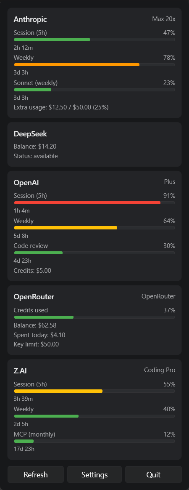
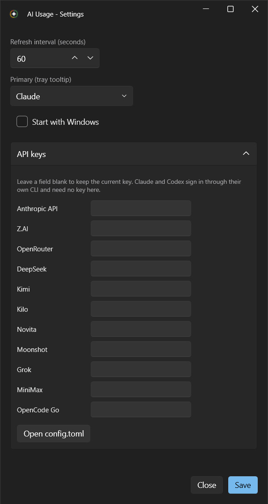
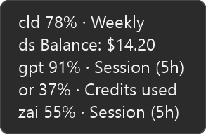
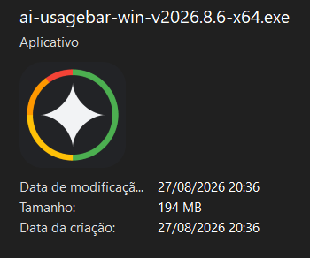

# ai-usagebar-win

> **Attribution:** This project is a structural evolution of the original
> [ai-usagebar-win](https://github.com/FranzoiDev/ai-usagebar-win) by
> Gabriel Franzoi. The WPF UI and concept were preserved, but the internal
> architecture was refactored to act as a wrapper around the
> [`ai-usagebar`](https://github.com/akitaonrails/ai-usagebar) Rust CLI,
> delegating all API calls and credential management to the native binary.

Windows system-tray app that shows AI plan usage at a glance.

Built with **C# and WPF** on .NET 8, styled with
[`WPF-UI`](https://github.com/lepoco/wpfui) for a Fluent look (Mica backdrop,
dark theme, modern controls). The tray icon uses
[`H.NotifyIcon`](https://github.com/HavenDV/H.NotifyIcon); config is TOML via
[`Tomlyn`](https://github.com/xoofx/Tomlyn). The popup and settings windows
are native XAML.

## Install

1. Download `ai-usagebar-win-<version>-x64.exe` from the
   [latest release](https://github.com/CaTeIM/ai-usagebar-win/releases/latest).
2. Run it. An icon appears in the notification area, next to the clock.
3. Sign in to a provider once, if you have not already: run `claude` (or
   `codex`) in a terminal and complete its login. That login is what the app
   reads.

That is the whole installation. There is no installer, no runtime to add and no
separate download.

**You do not need Rust or `cargo`.** The release carries the `ai-usagebar`
binary inside the `.exe` and unpacks it on first use.

Requirements: Windows 10 version 2004 (build 19041) or later.

Usage shows up on the next refresh, within a minute. Before any provider is
signed in, the popup tells you what is missing instead of showing usage.

### Updating

Download the newer `.exe` and replace the old one. Settings and credentials live
outside the executable, so nothing is lost.

## How it works

This app does **not** call AI provider APIs and never touches your credentials.
It periodically runs `ai-usagebar usage --json`, the Rust CLI it ships with, and
renders the JSON that comes back. Every provider request, credential file and
API key is handled by that binary.

## Screenshots

|                                          Popup - click the tray icon                                           |                                                             Settings                                                              |
| :------------------------------------------------------------------------------------------------------------: | :-------------------------------------------------------------------------------------------------------------------------------: |
|  |  |

|                                  Tray tooltip - hover                                   |                                          App icon - the published .exe                                           |
| :-------------------------------------------------------------------------------------: | :--------------------------------------------------------------------------------------------------------------: |
|  |  |

## UI

- **Hover** the tray icon for a one-line-per-provider tooltip.
- **Click** the tray icon for a popup with a card and progress bars per
  provider.
- **Settings** (button in the popup) opens a window to set the refresh
  interval, choose the primary provider, toggle **Start with Windows**, and
  enter the **API key** for any provider that uses one. Providers that sign in
  through their own CLI, like Claude and Codex, need no key.
- **Quit** (button in the popup) exits the whole process.

The icon color tracks worst-case usage: green <50%, yellow >=50%, orange >=75%,
red >=90%.

## Config

Optional, and split across two files:

- `%APPDATA%\ai-usagebar-win\settings.toml` holds `poll_seconds`, the refresh
  interval (default 60, minimum 15). This file belongs to the Windows app.
- `%APPDATA%\ai-usagebar\config\config.toml` holds `[ui] primary`, the provider
  shown first in the tooltip and popup. This file belongs to the Rust CLI.

Keep `poll_seconds` out of the CLI's file. The CLI rejects unknown top-level
keys and refuses to parse the whole file, which leaves the app showing only a
System Error.

API keys and the primary provider are written by the `ai-usagebar` CLI itself,
through its `settings apply` command, so comments and any keys this app does not
know about survive untouched. Keys are never displayed back: a blank field means
"leave it as it is". If a provider's key comes from an environment variable, the
window says so, because that value wins over anything saved in the file.

"Start with Windows" lives in the per-user `HKCU\...\Run` registry key.

## Build (contributors only)

Nothing in this section is needed to _use_ the app. It applies only to building
from source.

Requires:

- **.NET 8 SDK**
- **Windows 10 2004 (19041) or later** - WPF is Windows-only.
- **`ai-usagebar` on `PATH`** (`cargo install ai-usagebar`). This is the one
  case where Rust is needed: a local build does not bundle the CLI, unlike a
  release, so it falls back to whatever is on `PATH`.
- Optional: **Visual Studio 2022** with the _.NET Desktop Development_ workload.

```powershell
# Close a running instance first: it locks the .exe and the build fails with MSB3027.
Stop-Process -Name ai-usagebar-win -Force -ErrorAction SilentlyContinue

dotnet restore AiUsageBar.sln
dotnet build AiUsageBar/AiUsageBar.csproj -c Debug -p:Platform=x64

.\AiUsageBar\bin\x64\Debug\net8.0-windows10.0.19041.0\ai-usagebar-win.exe
```

`dotnet run` does not work here. It looks for the output under `bin\Debug\`,
while `Platform` puts it in `bin\x64\Debug\`, so it fails with "cannot find
the file". Run the produced `.exe` directly instead.

If the app then reports a missing .NET Desktop Runtime, the SDK was installed
privately (via `dotnet-install.ps1`) rather than by the official installer, and
the launcher cannot find it. Point it at the install once:

```powershell
[Environment]::SetEnvironmentVariable('DOTNET_ROOT', "$env:LOCALAPPDATA\Microsoft\dotnet", 'User')
```

This affects local builds only. Releases are published `--self-contained`, so
users never need a runtime installed.

Or open `AiUsageBar.sln` in Visual Studio, set the platform to **x64**, and
press F5.

## Releasing (maintainers only)

Close the changelog (rename `## [Unreleased]` to `## [<version>] - <YYYY-MM-DD>`,
open a fresh empty `[Unreleased]`, update the footer links), bump `<Version>` in
`AiUsageBar/AiUsageBar.csproj`, commit both, then:

```powershell
git tag v<version>
git push origin v<version>
```

Both lines are required: `git tag` only creates it locally, and the push is what
triggers the workflow. Nothing is published until the tag is pushed.

The `release` workflow then, on the runner:

1. compiles the current `ai-usagebar` from crates.io,
2. checks that CLI against this app's JSON contract and **fails the release** if
   it no longer matches,
3. embeds it and publishes a single self-contained `.exe`,
4. records the bundled CLI version in the release notes.

That is why picking up upstream fixes needs no manual step: each release pulls
whatever is current. To catch a breaking change before publishing rather than
after, run `pwsh ./scripts/check-cli-contract.ps1` locally first, against a CLI
updated with `cargo install ai-usagebar --force`. That is optional, and it is
the only reason a maintainer would install Rust.

On first run the app adds a **Start Menu shortcut** (per-user, no admin needed),
so you can find it from Windows Search by typing "AI Usage Bar". Only one
instance runs at a time - launching it again while it's in the tray just
reopens the popup. **Quit** (in the popup) closes it.

## Layout

| Path                          | Purpose                                                        |
| ----------------------------- | -------------------------------------------------------------- |
| `Models/Interop.cs`           | JSON deserialization model for `ai-usagebar usage --json`      |
| `Models/ViewModels.cs`        | popup + settings view-models bound by XAML                     |
| `Services/Config.cs`          | TOML config load/save (poll interval, UI primary)              |
| `Services/Poller.cs`          | background polling loop - executes the Rust CLI                |
| `Services/Renderer.cs`        | JSON results -> tooltip + popup/settings view-models           |
| `Services/TrayIconFactory.cs` | severity-tinted tray icon drawn in code                        |
| `Services/TrayService.cs`     | H.NotifyIcon wrapper                                           |
| `Services/StartupService.cs`  | "Start with Windows" via the HKCU Run key                      |
| `Services/ShortcutService.cs` | Start Menu shortcut so Search can find the app                 |
| `Services/NativeMethods.cs`   | Win32 interop (cursor position, DPI)                           |
| `Views/PopupWindow.xaml`      | frameless popup anchored near the tray                         |
| `Views/SettingsWindow.xaml`   | settings form (Fluent window)                                  |
| `App.xaml.cs`                 | tray-first app wiring; single-instance + shortcut on first run |
| `Converters.cs`               | XAML value converters (severity to brush, bool to visibility)  |

## License

MIT. See [LICENSE](LICENSE).

Based on [FranzoiDev/ai-usagebar-win](https://github.com/FranzoiDev/ai-usagebar-win).
Data layer powered by [akitaonrails/ai-usagebar](https://github.com/akitaonrails/ai-usagebar).
